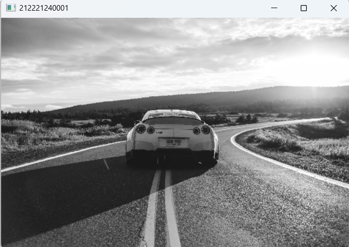
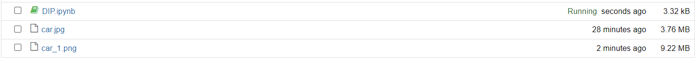
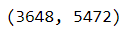
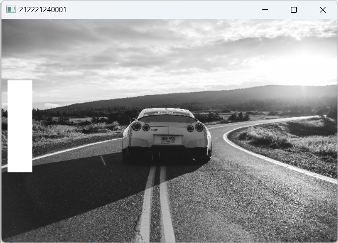
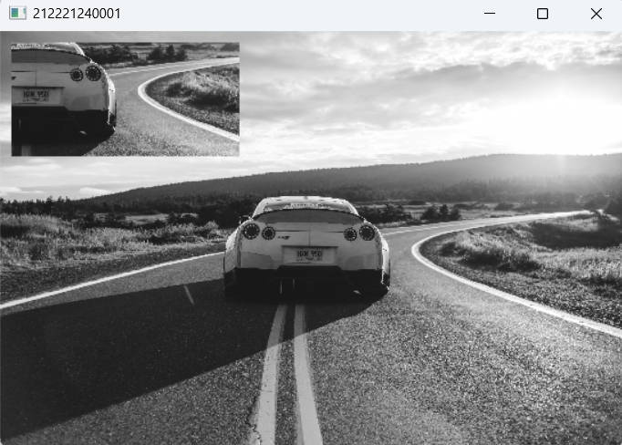

# READ AND WRITE AN IMAGE
## AIM
To write a python program using OpenCV to do the following image manipulations.
i) Read, display, and write an image.
ii) Access the rows and columns in an image.
iii) Cut and paste a small portion of the image.

## Software Required:
Anaconda - Python 3.7
## Algorithm:
### Step1:
Choose an image and save it as a filename.jpg
### Step2:
Use imread(filename, flags) to read the file.
### Step3:
Use imshow(window_name, image) to display the image.
### Step4:
Use imwrite(filename, image) to write the image.
### Step5:
End the program and close the output image windows.
## Program:
### Developed By: Aakash S
### Register Number: 212221240001
i) #To Read,display the image
```
import cv2
img = cv2.imread('car.jpg', 0)
resized_img = cv2.resize(img, None, fx=0.1, fy=0.1)
cv2.imshow('212221240001', resized_img)
cv2.waitKey(0)
cv2.destroyAllWindows()
```
ii) #To write the image
```
import cv2
img=cv2.imread('car.jpg',0)
cv2.imwrite('writed_walt.png',img)
```
iii) #Find the shape of the Image
```python3
import cv2
img=cv2.imread('car.jpg',0)
print(img.shape)
```
iv) #To access rows and columns

```python3
import cv2
img = cv2.imread('car.jpg', 0)
resized_img = cv2.resize(img, None, fx=0.1, fy=0.1)
for i in range(100, 250):
    for j in range(10, 50):
        resized_img[i][j] = 255  # Set the pixel to white
cv2.imshow('212221240001', resized_img)
cv2.waitKey(0)
cv2.destroyAllWindows()
```
v) #To cut and paste portion of image
```python3
import cv2
img = cv2.imread('car.jpg', 0)
resized_img = cv2.resize(img, None, fx=0.1, fy=0.1)
copied_portion = resized_img[150:250, 250:450]
resized_img[10:110, 10:210] = copied_portion
cv2.imshow('212221240001', resized_img)
cv2.waitKey(0)
cv2.destroyAllWindows()
```

## Output:

### i) Read and display the image

<br>

<br>

### ii)Write the image

<br>

<br>

### iii)Shape of the Image

<br>

<br>

### iv)Access rows and columns
<br>

<br>

### v)Cut and paste portion of image
<br>

<br>

## Result:
Thus the images are read, displayed, and written successfully using the python program.
